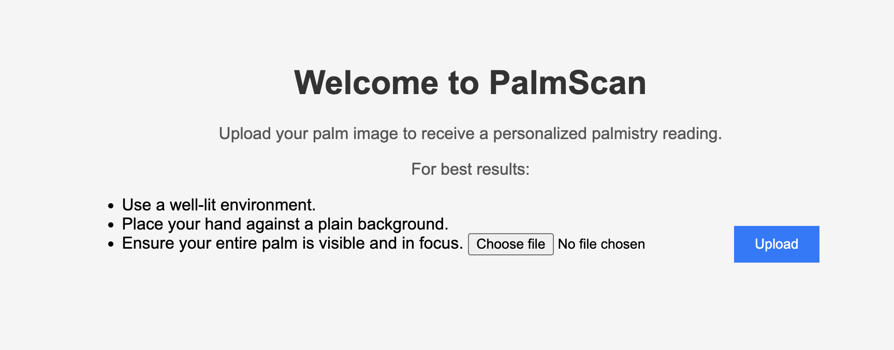

# PalmScan


[](https://opensource.org/licenses/MIT)
[]

A Flask web application that allows users to upload palm images, detects palm lines using OpenCV, and provides simulated palmistry readings.

## Features

- **Upload Palm Images**: Users can upload images of their palm directly through the web interface.
- **Palm Line Detection**: Utilizes OpenCV to detect and highlight palm lines in the uploaded images.
- **Simulated Palmistry Readings**: Provides randomly generated palmistry readings for entertainment purposes.
- **Responsive Design**: The application is accessible on various devices, including desktops and mobile phones.

## Demo

*Note: A live demo is currently unavailable by money issue.*

## Screenshots

### Home Page




## Installation

To run this application locally, follow these steps:

1. **Clone the Repository:**

   ```
   git clone https://github.com/AnnChangSal/palmscan.git
   cd palmscan
   ```
2. ***Create and Activate a Virtual Environment:***

  ```
  python -m venv venv
  ```
  # On macOS/Linux:
  ```
  source venv/bin/activate
  ```
  # On Windows:
  
  ```
  venv\Scripts\activate
  ```

3. **Install Dependencies:**
  
  ```
  pip install -r requirements.txt
  ```
4. **Run the Application:**

  ```
  python app.py
  ```
5. **Access the Application:**

Open your web browser and navigate to http://localhost:5001.
(Or follow the Terminal Instruction)

## Usage
-  **Navigate to the Home Page:** Upon launching the application, you'll see the home page where you can upload your palm image.
- **Upload an Image:** Click on the "Choose File" button to select an image of your palm, then click "Upload".
- **View Results:** After uploading, the application will process your image, highlight your palm lines, and display a simulated palmistry reading.
- **Upload Another Image:** You can return to the home page to upload another image.

## Technologies Used
- Python 3.10
- Flask 2.2.5
- OpenCV 4.8.0.74
- NumPy 1.24.3
- Gunicorn 20.1.0
- Whitenoise 6.4.0
- Flask-SSLify 0.1.5


## Project Structure

```
palmscan/
├── app.py
├── templates/
│   ├── index.html
│   └── result.html
├── static/
│   ├── css/
│   │   └── styles.css
│   └── uploads/
├── requirements.txt
├── Procfile
├── runtime.txt
├── .gitignore
├── LICENSE
└── README.md
```


## License

This project is licensed under the **MIT License**

## Acknowledgments
Flask Documentation: https://flask.palletsprojects.com/
OpenCV Documentation: https://docs.opencv.org/
Shields.io for Badges: https://shields.io/
Heroku: https://www.heroku.com/
